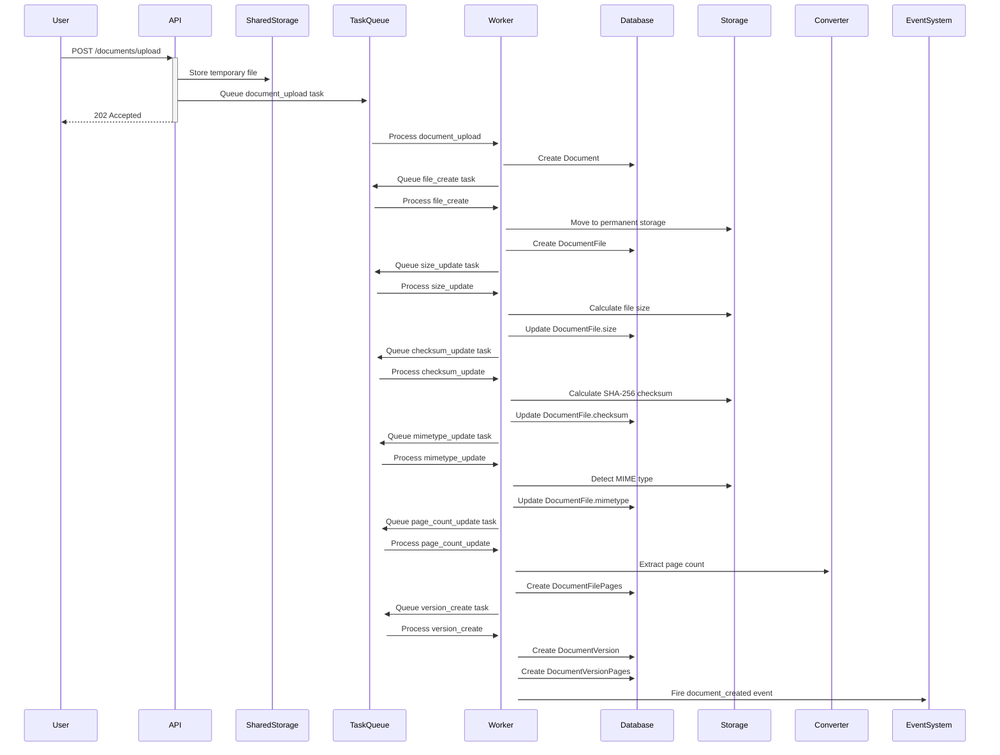
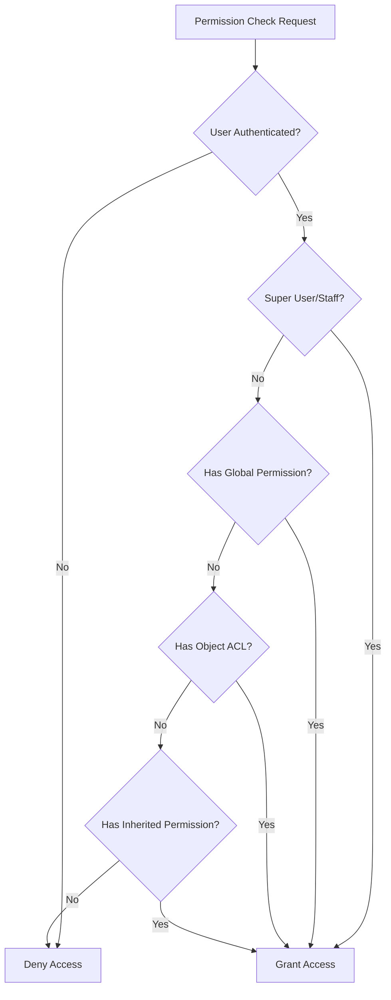

# 🏛️ Mayan EDMS Architecture Deep Dive

> **Last Updated**: December 2024  
> **Purpose**: Comprehensive architectural guide for developers working with Mayan EDMS  
> **Audience**: Senior developers extending or modifying Mayan EDMS

## 📋 Table of Contents

1. [System Overview & Design Philosophy](#system-overview--design-philosophy)
2. [Django Application Architecture](#django-application-architecture)
3. [Document Management Core](#document-management-core)
4. [Storage System Architecture](#storage-system-architecture)
5. [Permission & Access Control System](#permission--access-control-system)
6. [Task Management & Background Processing](#task-management--background-processing)
7. [Event System & Signals](#event-system--signals)
8. [Navigation & UI Framework](#navigation--ui-framework)
9. [Configuration Management (Smart Settings)](#configuration-management-smart-settings)
10. [Extension Patterns & Hooks](#extension-patterns--hooks)
11. [Data Flow & Lifecycle](#data-flow--lifecycle)
12. [Development Guidelines](#development-guidelines)

---

## 🎯 System Overview & Design Philosophy

### Core Design Principles

Mayan EDMS follows a **strict philosophical framework** that governs all development decisions:

#### 1. **Market Independence**
- Code for the 95% of use cases, not specific industries
- Avoid sector-specific hardcoded logic
- Provide generic building blocks that can be configured

#### 2. **Maximum Abstraction**
- Each app is an expert in ONE thing only
- Apps communicate through well-defined APIs/classes/functions
- Dependency flows downward only (parent → child, never child → parent)

#### 3. **Infrastructure Agnostic**
- No assumptions about hardware, OS, or storage
- Single-step Python-based installation
- Avoid hard binary dependencies unless absolutely necessary

#### 4. **Driver-Based Architecture**
- Switchable backends for storage, authentication, processing
- Plugin system for extensibility
- Configuration over code changes

#### 5. **App Independence**
- Each Django app is self-contained
- Minimal dependencies except for core: navigation, permissions, common
- Generic apps bridge functionality between specialized apps

### Hierarchical Dependency Model

```
┌─────────────────┐
│   Documents     │ ← Core entity (never imports from children)
├─────────────────┤
│   Permissions   │ ← Base permission system
│   Common       │ ← Shared utilities
│   Navigation   │ ← UI framework
├─────────────────┤
│   Storage      │ ← Abstraction layer
│   Events       │ ← Event system
│   Task Manager │ ← Background processing
├─────────────────┤
│   Cabinets     │ ← Document organization
│   Metadata     │ ← Document metadata
│   Indexing     │ ← Search & indexing
│   Checkouts    │ ← Document checkout system
└─────────────────┘
```

---

## 🏗️ Django Application Architecture

### App Organization Structure

Mayan EDMS uses a **modular Django application architecture** with 40+ specialized apps:

```python
# In mayan/settings/base.py - Load order is CRITICAL:

INSTALLED_APPS = (
    # 1. Events must be first (preloads all events)
    'mayan.apps.events.apps.EventsApp',
    
    # 2. Appearance (template overrides)
    'mayan.apps.appearance.apps.AppearanceApp',
    
    # 3. Logging (early initialization)
    'mayan.apps.logging.apps.LoggingApp',
    
    # 4. Task Manager (queues before other apps use them)
    'mayan.apps.task_manager.apps.TaskManagerApp',
    
    # 5. Core systems
    'mayan.apps.acls.apps.ACLsApp',
    'mayan.apps.user_management.apps.UserManagementApp',
    'mayan.apps.authentication.apps.AuthenticationApp',
    
    # 6. Foundation systems
    'mayan.apps.storage.apps.StorageApp',
    'mayan.apps.permissions.apps.PermissionsApp',
    
    # 7. Documents FIRST (signal priorities)
    'mayan.apps.documents.apps.DocumentsApp',
    
    # 8. Document-related apps
    'mayan.apps.cabinets.apps.CabinetsApp',
    'mayan.apps.checkouts.apps.CheckoutsApp',
    # ... many more
)
```

### MayanAppConfig Pattern

Every app extends `MayanAppConfig` with standardized structure:

```python
class DocumentsApp(MayanAppConfig):
    app_namespace = 'documents'  # URL namespace
    app_url = 'documents'        # URL prefix
    has_rest_api = True          # DRF integration
    has_tests = True             # Test suite
    name = 'mayan.apps.documents'
    verbose_name = _('Documents')
    
    def ready(self):
        super().ready()
        # App initialization logic
        # Model registration
        # Event registration
        # Permission setup
        # Menu binding
```

### Inter-App Communication Patterns

#### 1. **Direct Import Pattern** (Parent to Child only)
```python
# ✅ CORRECT: Parent imports child
from mayan.apps.documents.models import Document

# ❌ WRONG: Child imports parent
from mayan.apps.cabinets.models import Cabinet  # In documents app
```

#### 2. **Late Import Pattern** (Avoiding circular imports)
```python
def some_method(self):
    # Import inside method to avoid circular dependency
    Document = apps.get_model(app_label='documents', model_name='Document')
    return Document.objects.filter(...)
```

#### 3. **Signal-Based Communication**
```python
# Sender
from mayan.apps.documents.signals import signal_post_document_file_upload
signal_post_document_file_upload.send(sender=DocumentFile, instance=self)

# Receiver
@receiver(signal_post_document_file_upload)
def handle_document_upload(sender, instance, **kwargs):
    # Process upload in another app
```

---

## 📄 Document Management Core

### Document Entity Hierarchy

The document system uses a **4-tier model**:

```
DocumentType (Template/Category)
    └── Document (Container)
        ├── DocumentFile (Physical file)
        │   └── DocumentFilePage (File pages)
        └── DocumentVersion (View/Presentation)
            └── DocumentVersionPage (Version pages)
```

### Document Lifecycle

#### 1. **Document Creation**
```python
# Via DocumentType
document = document_type.documents_create(
    label="My Document",
    description="Document description",
    user=request.user
)
```

#### 2. **File Upload Process**
```python
# Step 1: Create SharedUploadedFile
shared_file = SharedUploadedFile.objects.create(file=upload)

# Step 2: Async task chain
task_document_upload.apply_async(kwargs={
    'document_type_id': document_type.pk,
    'shared_uploaded_file_id': shared_file.pk,
    'user_id': user.pk
})

# Task chain:
# task_document_upload → 
# task_document_file_create → 
# task_document_file_size_update → 
# task_document_file_checksum_update → 
# task_document_file_mimetype_update → 
# task_document_file_page_count_update → 
# task_document_file_version_create
```

#### 3. **Version Management**
- **Document File**: Immutable physical file
- **Document Version**: Configurable view of pages
- Version pages can be reordered, disabled, or mapped from multiple files
- Only ONE active version per document

### Document Storage Pattern

```python
class DocumentFile(models.Model):
    document = models.ForeignKey(Document, related_name='files')
    file = models.FileField(
        storage=DefinedStorageLazy(name=STORAGE_NAME_DOCUMENT_FILES),
        upload_to=upload_to  # Delegates to DocumentType
    )
    filename = models.CharField(max_length=255)
    checksum = models.TextField()  # SHA-256
    mimetype = models.CharField(max_length=255)
    size = models.PositiveIntegerField()
```

### Document Actions & Hooks

Mayan uses an **action-based system** for document file processing:

```python
class DocumentFileAction:
    @staticmethod
    def execute(document, document_file, comment, user):
        # Different actions:
        # - 'append': Add pages to existing version
        # - 'replace': Replace current version
        # - 'new_version': Create new version
```

---

## 💾 Storage System Architecture

### Abstraction Layer Design

Mayan's storage system provides **complete abstraction** over physical storage:

```python
class DefinedStorage:
    def __init__(self, dotted_path, label, name, kwargs=None):
        self.dotted_path = dotted_path  # Django storage backend
        self.kwargs = kwargs or {}       # Backend arguments
        self.name = name                # Internal identifier
        
    def get_storage_instance(self):
        storage_class = import_string(self.dotted_path)
        return storage_class(**self.kwargs)
```

### Storage Backend Types

#### 1. **Filesystem Storage**
```python
storage_document_files = DefinedStorage(
    dotted_path='django.core.files.storage.FileSystemStorage',
    name='documents__documentfile',
    kwargs={'location': '/var/lib/mayan/documents'}
)
```

#### 2. **S3-Compatible Storage**
```python
# Via django-storages
storage_document_files = DefinedStorage(
    dotted_path='storages.backends.s3boto3.S3Boto3Storage',
    name='documents__documentfile',
    kwargs={
        'bucket_name': 'mayan-documents',
        'region_name': 'us-east-1'
    }
)
```

#### 3. **Passthrough Storage** (Encryption/Compression)
```python
class EncryptedPassthroughStorage(PassthroughStorage):
    def __init__(self, password, next_storage_backend, **kwargs):
        # Wraps another storage with encryption
        self.key = PBKDF2(password=password, salt=settings.SECRET_KEY)
        super().__init__(
            next_storage_backend=next_storage_backend,
            **kwargs
        )
```

### File Upload Workflow

1. **Client Upload** → `SharedUploadedFile` (temporary storage)
2. **Background Task** → Process and move to permanent storage
3. **Storage Backend** → Save to configured storage (FS/S3/etc.)
4. **Cleanup** → Remove temporary file

### Storage Configuration

```python
# Environment variables control storage
MAYAN_DOCUMENT_FILE_STORAGE_BACKEND = 'storages.backends.s3boto3.S3Boto3Storage'
MAYAN_DOCUMENT_FILE_STORAGE_BACKEND_ARGUMENTS = {
    'bucket_name': 'my-documents',
    'region_name': 'us-west-2'
}
```

---

## 🔒 Permission & Access Control System

### Three-Tier Permission Architecture

```
1. Global Permissions (Via Roles)
2. Object-Level ACLs (Per-object permissions)  
3. Inherited Permissions (From related objects)
```

### Role-Based Access Control (RBAC)

```python
# Users belong to Groups
# Groups belong to Roles  
# Roles have Permissions

User → Group → Role → Permission
```

### Access Control Lists (ACLs)

```python
class AccessControlList(models.Model):
    content_type = models.ForeignKey(ContentType)  # Object type
    object_id = models.PositiveIntegerField()      # Object ID
    role = models.ForeignKey(Role)                 # Role granted access
    permissions = models.ManyToManyField(StoredPermission)

# Grant permission
AccessControlList.objects.grant(
    obj=document,
    permission=permission_document_view,
    role=accountants_role
)
```

### Permission Inheritance

```python
# Document inherits from DocumentType
ModelPermission.register_inheritance(
    model=Document,
    related='document_type'  # Field path to parent
)

# Permission check order:
# 1. User has global permission?
# 2. User has object ACL permission?
# 3. User has inherited permission from parent?
```

### Permission Checking

```python
# In views/API
AccessControlList.objects.check_access(
    obj=document,
    permission=permission_document_view,
    user=request.user
)

# Queryset filtering
queryset = AccessControlList.objects.restrict_queryset(
    permission=permission_document_view,
    queryset=Document.objects.all(),
    user=request.user
)
```

### Permission Registration

```python
# Define permissions
namespace = PermissionNamespace(label='Documents', name='documents')
permission_document_view = namespace.add_permission(
    label='View documents', name='document_view'
)

# Register with model
ModelPermission.register(
    model=Document,
    permissions=(permission_document_view, permission_document_edit)
)
```

---

## ⚡ Task Management & Background Processing

### Celery Integration Architecture

Mayan uses **Celery with Redis/RabbitMQ** for async processing:

```python
# Celery app configuration
app = Celery('mayan')
app.config_from_object('mayan.settings.base')
```

### Worker Hierarchy System

```python
# 5 Worker classes with different priorities
worker_a = Worker(  # High-volume, low-latency
    concurrency=MAYAN_WORKER_A_CONCURRENCY,
    description='Low latency high volume tasks',
    maximum_memory_per_child=MAYAN_WORKER_A_MAX_MEMORY_PER_CHILD
)

worker_b = Worker(  # Medium latency
    description='Medium latency tasks'
)

worker_c = Worker(  # Periodic tasks
    description='Medium latency tasks'
)

worker_d = Worker(  # Single-threaded
    concurrency=1,
    description='Single-threaded tasks'
)

worker_e = Worker(  # Batch processing
    description='Batch processing tasks'
)
```

### Queue Management

```python
class CeleryQueue:
    def __init__(self, name, label, worker, default_queue=False, transient=False):
        self.name = name
        self.worker = worker
        self.transient = transient  # Lost on broker restart
        self.task_types = []
        
    def add_task_type(self, dotted_path, label, schedule=None):
        task_type = TaskType(
            dotted_path=dotted_path,
            label=label,
            schedule=schedule  # For periodic tasks
        )
        self.task_types.append(task_type)
```

### Task Definition Pattern

```python
@app.task(bind=True, ignore_result=True, retry_backoff=True)
def task_document_file_create(
    self, document_id, shared_uploaded_file_id, **kwargs
):
    try:
        # Task logic
        document = Document.objects.get(pk=document_id)
        # Process...
    except OperationalError as exception:
        # Retry on DB errors
        raise self.retry(exc=exception)
    except Exception as exception:
        # Log and re-raise other errors
        logger.critical('Unexpected exception: %s', exception)
        raise
```

### Task Chain Pattern

```python
# Chained task execution
task_document_file_create.apply_async(kwargs=...).then(
    task_document_file_size_update.apply_async(kwargs=...)
).then(
    task_document_file_checksum_update.apply_async(kwargs=...)
)
```

### Queue Assignment

```python
# Documents app queues
queue_documents_fast.add_task_type(
    dotted_path='mayan.apps.documents.tasks.task_document_file_create',
    label='Create new document file'
)

queue_documents_slow.add_task_type(
    dotted_path='mayan.apps.documents.tasks.task_document_file_upload',
    label='Upload new document file'
)
```

---

## 📡 Event System & Signals

### Event-Driven Architecture

Mayan uses a **comprehensive event system** for loose coupling:

```python
# Event definition
event_document_created = EventTypeNamespace.add_event_type(
    label='Document created',
    name='document_created'
)

# Event firing
@method_event(
    event_manager_class=EventManagerSave,
    created={'event': event_document_created, 'target': 'self'}
)
def save(self, *args, **kwargs):
    super().save(*args, **kwargs)
```

### Event Types

1. **Document Events**: Created, edited, viewed, deleted
2. **File Events**: Uploaded, processed, checksum updated
3. **Version Events**: Created, activated, page added/removed
4. **Access Events**: ACL granted/revoked, permission checked
5. **System Events**: Settings changed, backup created

### Event Storage

```python
# Events stored in database via django-activity-stream
class Action(models.Model):  # From actstream
    actor = models.ForeignKey(User)     # Who performed action
    verb = models.CharField()           # What was done
    target = GenericForeignKey()        # What was acted upon
    action_object = GenericForeignKey() # Related object
    timestamp = models.DateTimeField()
```

### Event Subscription

```python
class ObjectEventSubscription(models.Model):
    content_type = models.ForeignKey(ContentType)
    object_id = models.PositiveIntegerField()
    user = models.ForeignKey(User)
    event_type = models.ForeignKey(StoredEventType)
    
    # User subscribes to events on specific objects
```

### Signal Integration

```python
# Document-specific signals
signal_post_document_file_upload = Signal(use_caching=True)
signal_post_document_version_remap = Signal(use_caching=True)

# Usage
@receiver(signal_post_document_file_upload)
def handle_file_upload(sender, instance, **kwargs):
    # Trigger OCR, metadata extraction, etc.
```

---

## 🧭 Navigation & UI Framework

### Menu System Architecture

Mayan uses a **dynamic menu system** that adapts based on context:

```python
class Menu:
    def __init__(self, name, label=None, condition=None):
        self.name = name
        self.label = label
        self.condition = condition  # Show/hide based on context
        self.bound_links = {}       # Links bound to objects/views
        
    def bind_links(self, links, sources=None, exclude=None):
        # Bind links to specific models or views
        for source in sources:
            self.bound_links.setdefault(source, []).extend(links)
```

### Link Resolution System

```python
class Link:
    def __init__(self, text, view=None, permission=None, condition=None):
        self.text = text
        self.view = view
        self.permission = permission    # Required permission
        self.condition = condition      # Display condition
        
    def resolve(self, context):
        # Check permissions
        if self.permission:
            try:
                AccessControlList.objects.check_access(
                    obj=context['object'],
                    permission=self.permission,
                    user=context['request'].user
                )
            except PermissionDenied:
                return None
                
        # Generate URL
        url = reverse(self.view, kwargs=context.get('kwargs', {}))
        return ResolvedLink(link=self, url=url)
```

### Context-Aware Navigation

```python
# Menu resolution considers:
# 1. Current view name
# 2. Object in context (document, cabinet, etc.)
# 3. User permissions
# 4. Custom conditions

menu_results = menu_object.resolve(
    context={
        'object': document,
        'request': request,
        'view': current_view
    }
)
```

### Menu Types

1. **main**: Top-level navigation
2. **secondary**: Contextual actions  
3. **object**: Object-specific actions
4. **list_facet**: List view filters
5. **multi_item**: Bulk actions
6. **topbar**: User/system actions

### Menu Binding Pattern

```python
# In app ready() method
menu_object.bind_links(
    links=(link_document_edit, link_document_delete),
    sources=(Document,)  # Show on Document objects
)

menu_secondary.bind_links(
    links=(link_document_create,),
    sources=('documents:document_list',)  # Show on list view
)
```

---

## ⚙️ Configuration Management (Smart Settings)

### Settings Architecture

Mayan's **Smart Settings** system provides:
- Environment variable integration
- Runtime configuration changes
- Validation and type checking
- Namespace organization

```python
class SettingNamespace:
    def __init__(self, label, name):
        self.label = label
        self.name = name
        self.settings = {}
        
    def do_setting_add(self, global_name, default, help_text=None):
        setting = Setting(
            global_name=global_name,
            default=default,
            help_text=help_text,
            namespace=self
        )
        self.settings[global_name] = setting
        return setting
```

### Setting Definition

```python
# Create namespace
setting_namespace = setting_cluster.do_namespace_add(
    label='Documents', name='documents'
)

# Add settings
setting_language = setting_namespace.do_setting_add(
    default='en',
    global_name='DOCUMENTS_LANGUAGE',
    help_text='Default document language'
)
```

### Environment Variable Integration

```python
# Settings automatically read from environment
# MAYAN_DOCUMENTS_LANGUAGE overrides default

# In Django settings
MAYAN_DATABASES = "{'default': {'ENGINE': 'django.db.backends.postgresql', ...}}"
MAYAN_CELERY_BROKER_URL = "redis://redis:6379/0"
```

### Runtime Configuration

```python
# Settings can be changed at runtime
setting_language.value = 'es'
setting_language.save()

# Triggers update callbacks
setting_cluster.do_settings_updated_clear()
setting_cluster.do_post_edit_function_call()
```

---

## 🔌 Extension Patterns & Hooks

### Model Hook System

```python
class HooksModelMixin:
    _hooks_pre_create = []
    _post_save_hooks = []
    
    @classmethod
    def execute_pre_create_hooks(cls, kwargs):
        for hook in cls._hooks_pre_create:
            hook(**kwargs)
```

### Backend System Pattern

```python
class BaseBackend:
    _registry = {}
    
    @classmethod
    def register(cls, backend_class):
        cls._registry[backend_class.name] = backend_class
        
    @classmethod
    def get_backend(cls, name):
        return cls._registry[name]

# Usage for storage, authentication, OCR, etc.
```

### App Module Loading

```python
class AppsModuleLoaderMixin:
    _loader_module_name = None  # e.g., 'permissions', 'queues'
    
    @classmethod
    def load_modules(cls):
        # Auto-discover and load modules from all apps
        for app_config in apps.get_app_configs():
            try:
                module = import_module(f'{app_config.name}.{cls._loader_module_name}')
                # Module registers itself on import
            except ImportError:
                pass
```

### Document File Action System

```python
class DocumentFileAction:
    _registry = {}
    
    @classmethod
    def register(cls, action_class):
        cls._registry[action_class.action_id] = action_class
        
    def execute(self, document, document_file, user):
        # Custom processing logic
        pass

# Allows plugins to define custom file processing
```

---

## 🔄 Data Flow & Lifecycle

### Document Upload Complete Flow



### Permission Check Flow



### Event Propagation Flow


---

## 📚 Development Guidelines

### Code Organization Principles

#### 1. **Variable Naming Convention**
```python
# Major to Minor convention with underscores
link_document_page_transformation_list = ...
permission_smart_link_view = ...
MAYAN_WORKER_A_CONCURRENCY = ...
```

#### 2. **Class Structure**
```python
class DocumentPageTransformation(models.Model):
    # Fields first
    document_page = models.ForeignKey(...)
    transformation_type = models.CharField(...)
    
    # Meta class
    class Meta:
        ordering = ('order',)
        
    # String representation
    def __str__(self):
        return self.get_label()
        
    # Properties
    @property
    def is_active(self):
        return self.enabled
        
    # Methods (alphabetical or by importance)
    def get_label(self):
        return self.transformation_type
```

#### 3. **Migration Strategy**
- One thing per migration (create table OR move data OR remove table)
- Aids retrying on failure
- Easier debugging and rollback

#### 4. **Import Organization**
```python
# Standard library
import logging
from pathlib import Path

# Django imports  
from django.db import models
from django.urls import reverse

# Third-party imports
from PIL import Image

# Local imports
from mayan.apps.common.utils import get_class_name
from .mixins import DocumentMixin
```

### Testing Patterns

#### 1. **Test Structure**
```python
class DocumentTestCase(GenericViewTestCase):
    def setUp(self):
        super().setUp()
        self._create_test_document_type()
        self._create_test_document()
        
    def test_document_creation(self):
        # Test logic
        pass
        
    def test_document_upload(self):
        # Test logic
        pass
```

#### 2. **Mixin Usage**
```python
class ACLTestMixin:
    def _create_acl_test_object(self):
        # Create test object with ACL
        pass
        
    def grant_access(self, obj, permission):
        # Grant permission helper
        pass
```

### API Development Patterns

#### 1. **ViewSet Structure**
```python
class APIDocumentViewSet(
    ParentObjectDocumentAPIViewMixin,
    generics.ListCreateAPIView
):
    mayan_external_object_permission_map = {
        'GET': permission_document_view,
        'POST': permission_document_create
    }
    serializer_class = DocumentSerializer
    
    def get_source_queryset(self):
        return Document.objects.all()
```

#### 2. **Serializer Patterns**
```python
class DocumentSerializer(serializers.ModelSerializer):
    document_type_id = serializers.IntegerField(write_only=True)
    
    class Meta:
        model = Document
        fields = ('id', 'label', 'document_type_id', ...)
        read_only_fields = ('id', 'uuid', 'datetime_created')
```

### Performance Considerations

#### 1. **Queryset Optimization**
```python
# Use select_related for ForeignKey
documents = Document.objects.select_related('document_type')

# Use prefetch_related for reverse FK and M2M
documents = Document.objects.prefetch_related('files', 'versions')

# Use only() for specific fields
documents = Document.objects.only('id', 'label', 'uuid')
```

#### 2. **Caching Strategies**
```python
@cache
def get_links_for_class_cached(self, navigation_object_class):
    # Cache expensive menu calculations
    return self.get_links_for_class_non_cached(navigation_object_class)
```

#### 3. **Task Optimization**
```python
# Use appropriate queue for task priority
queue_documents_fast.add_task_type(...)  # High priority
queue_documents_slow.add_task_type(...)  # Low priority

# Retry pattern for transient failures
@app.task(bind=True, retry_backoff=True)
def my_task(self):
    try:
        # Task logic
        pass
    except OperationalError as exception:
        raise self.retry(exc=exception)
```

---

## 🎯 Summary

Mayan EDMS is a **sophisticated, modular document management system** built on Django with the following key architectural principles:

### 🏗️ **Architectural Strengths**
- **Modular Design**: 40+ independent Django apps
- **Abstraction Layers**: Storage, permissions, tasks, events
- **Extensibility**: Hook systems, backends, and plugin architecture
- **Scalability**: Async processing, multiple workers, queue management

### 🔑 **Key Systems**
- **Document Management**: Multi-tier model (Type→Document→File→Version)
- **Permission System**: Three-tier RBAC with ACLs and inheritance
- **Storage Abstraction**: Support for filesystem, S3, encrypted storage
- **Task Management**: Celery-based with 5-tier worker system
- **Event System**: Comprehensive event tracking and subscription
- **Navigation Framework**: Dynamic, permission-aware menus

### 🛠️ **Development Philosophy**
- Market-independent, configurable solutions
- Single-responsibility principle per app
- Minimal dependencies, maximum abstraction
- Driver-based extensibility

This architecture enables Mayan EDMS to be both **powerful and flexible**, supporting enterprise-scale deployments while remaining maintainable and extensible for custom implementations.

---

**Next Steps for Extension Development:**
1. Follow the hierarchical dependency model
2. Use the established patterns (hooks, backends, signals)
3. Leverage the permission and event systems
4. Implement proper task queuing for async operations
5. Follow the navigation and UI patterns for consistency 